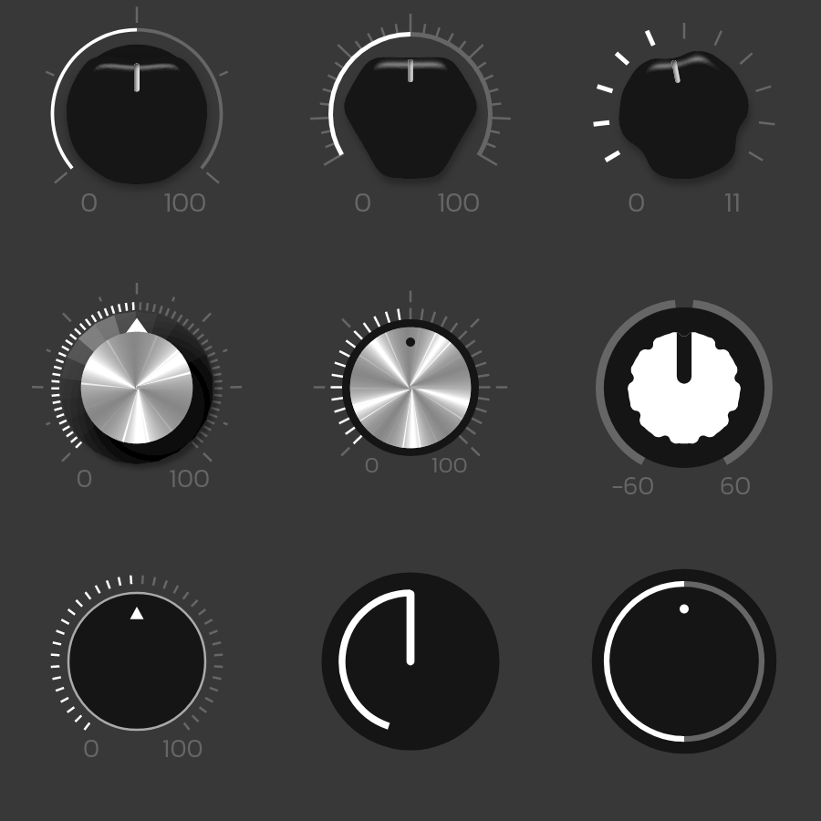

<h1>
x-knob <a href="https://npmjs.org/package/x-knob"></a> <a href="src"></a> <a href="https://cdn.jsdelivr.net/npm/x-knob@2.0.0/dist/x-knob.min.js"></a> <a href="LICENSE"></a>
</h1>

<p></p>

Web Component Knobs

<h4>
<table><tr><td title="Triple click to select and copy paste">
<code>npm i x-knob </code>
</td><td title="Triple click to select and copy paste">
<code>pnpm add x-knob </code>
</td><td title="Triple click to select and copy paste">
<code>yarn add x-knob</code>
</td></tr></table>
</h4>

## Examples

<details id="example$web" title="web" open><summary><span><a href="#example$web">#</a></span>  <code><strong>web</strong></code></summary>  <ul><p></p>  <a href="https://stagas.github.io/x-knob/example/web.html"></img>  <p><strong>Try it live</strong></p></a>    <details id="source$web" title="web source code" ><summary><span><a href="#source$web">#</a></span>  <code><strong>view source</strong></code></summary>  <a href="example/web.ts">example/web.ts</a>  <p>

```ts
import { KnobElement } from 'x-knob'

customElements.define('x-knob', KnobElement)

// @ts-ignore
const fontUrl = new URL('Kanit-Light.ttf', import.meta.url).toString()

document.body.innerHTML = /*html*/ `
<style>
@font-face {
  src: url(${fontUrl}) format('truetype');
  font-family: 'Kanit';
  font-style: 'light';
  font-display: 'fallback';
}
html,
body {
  width: 100%;
  height: 100%;
  background: #383838;
}
x-knob {
  width: 150px;
  height: 150px;
  font-family: Kanit;
}
</style>
<div id="demo" style="display:grid;grid:1fr 1fr 1fr/1fr 1fr 1fr;width:450px">
<x-knob theme="power" value="50"></x-knob>
<x-knob theme="intense" value="50"></x-knob>
<x-knob theme="amp" value="5" max="11" step="0.1"></x-knob>
<x-knob theme="retro" value="50"></x-knob>
<x-knob theme="metallic" value="50"></x-knob>
<x-knob theme="sweet" symmetric min="-60" value="0" max="60"></x-knob>
<x-knob theme="flat" value="50"></x-knob>
<x-knob theme="ableton" value="50"></x-knob>
<x-knob theme="zen" value="50"></x-knob>
</div>
`

const knobs = document.querySelectorAll('x-knob') as NodeListOf<KnobElement>
let i = 0
const ivl = setInterval(() => {
  const knob = knobs[i++ % knobs.length]
  knob.targetValue! += (knob.normal > 0.5
    ? -1
    : knob.normal === 0.5
    ? (Math.random() - 0.5) * 2
    : 1)
    * Math.random()
    * knob.scale
    * 0.95
  if (i >= knobs.length)
    clearInterval(ivl)
}, 60)
```

</p>
</details></ul></details>

## API

<p>  <details id="KnobElement$2" title="Class" open><summary><span><a href="#KnobElement$2">#</a></span>  <code><strong>KnobElement</strong></code>    </summary>  <a href="src/x-knob.tsx#L14">src/x-knob.tsx#L14</a>  <ul>        <p>  <details id="constructor$3" title="Constructor" ><summary><span><a href="#constructor$3">#</a></span>  <code><strong>constructor</strong></code><em>()</em>    </summary>    <ul>    <p>  <details id="new KnobElement$4" title="ConstructorSignature" ><summary><span><a href="#new KnobElement$4">#</a></span>  <code><strong>new KnobElement</strong></code><em>()</em>    </summary>    <ul><p><a href="#KnobElement$2">KnobElement</a></p>        </ul></details></p>    </ul></details><details id="$$148" title="Property" ><summary><span><a href="#$$148">#</a></span>  <code><strong>$</strong></code>    </summary>  <a href="src/work/stagas/sigl/dist/types/sigl.d.ts#L26">src/work/stagas/sigl/dist/types/sigl.d.ts#L26</a>  <ul><p><span>Context</span>&lt;<a href="#KnobElement$2">KnobElement</a> &amp; <span>JsxContext</span>&lt;<a href="#KnobElement$2">KnobElement</a>&gt; &amp; <span>Omit</span>&lt;{<p>    <details id="ctor$152" title="Parameter" ><summary><span><a href="#ctor$152">#</a></span>  <code><strong>ctor</strong></code>    </summary>    <ul><p><span>Class</span>&lt;<a href="#T$112">T</a>&gt;</p>        </ul></details>  <p><strong></strong>&lt;<span>T</span>&gt;<em>(ctor)</em>  &nbsp;=&gt;  <ul><span>CleanClass</span>&lt;<a href="#T$112">T</a>&gt;</ul></p>  <details id="ctx$167" title="Parameter" ><summary><span><a href="#ctx$167">#</a></span>  <code><strong>ctx</strong></code>    </summary>    <ul><p><a href="#T$127">T</a> | <span>Class</span>&lt;<a href="#T$127">T</a>&gt;</p>        </ul></details>  <p><strong></strong>&lt;<span>T</span>&gt;<em>(ctx)</em>  &nbsp;=&gt;  <ul><span>Wrapper</span>&lt;<a href="#T$127">T</a>&gt;</ul></p></p>} &amp; <span>__module</span> &amp; {<p>  <details id="Boolean$171" title="Property" ><summary><span><a href="#Boolean$171">#</a></span>  <code><strong>Boolean</strong></code>    </summary>  <a href="src/work/stagas/sigl/dist/types/index.d.ts#L7">src/work/stagas/sigl/dist/types/index.d.ts#L7</a>  <ul><p>undefined | boolean</p>        </ul></details><details id="Number$170" title="Property" ><summary><span><a href="#Number$170">#</a></span>  <code><strong>Number</strong></code>    </summary>  <a href="src/work/stagas/sigl/dist/types/index.d.ts#L6">src/work/stagas/sigl/dist/types/index.d.ts#L6</a>  <ul><p>undefined | number</p>        </ul></details><details id="String$169" title="Property" ><summary><span><a href="#String$169">#</a></span>  <code><strong>String</strong></code>    </summary>  <a href="src/work/stagas/sigl/dist/types/index.d.ts#L5">src/work/stagas/sigl/dist/types/index.d.ts#L5</a>  <ul><p>undefined | string</p>        </ul></details></p>}, <code>"transition"</code>&gt;&gt;</p>        </ul></details><details id="arrow$40" title="Property" ><summary><span><a href="#arrow$40">#</a></span>  <code><strong>arrow</strong></code>  <span><span>&nbsp;=&nbsp;</span>  <code>...</code></span>  </summary>  <a href="src/x-knob.tsx#L65">src/x-knob.tsx#L65</a>  <ul><p>{<p>  <details id="pos$43" title="Property" ><summary><span><a href="#pos$43">#</a></span>  <code><strong>pos</strong></code>  <span><span>&nbsp;=&nbsp;</span>  <code>23</code></span>  </summary>    <ul><p>number</p>        </ul></details><details id="size$42" title="Property" ><summary><span><a href="#size$42">#</a></span>  <code><strong>size</strong></code>  <span><span>&nbsp;=&nbsp;</span>  <code>0</code></span>  </summary>    <ul><p>number</p>        </ul></details><details id="width$44" title="Property" ><summary><span><a href="#width$44">#</a></span>  <code><strong>width</strong></code>  <span><span>&nbsp;=&nbsp;</span>  <code>5</code></span>  </summary>    <ul><p>number</p>        </ul></details></p>}</p>        </ul></details><details id="circle$14" title="Property" ><summary><span><a href="#circle$14">#</a></span>  <code><strong>circle</strong></code>  <span><span>&nbsp;=&nbsp;</span>  <code>0</code></span>  </summary>  <a href="src/x-knob.tsx#L30">src/x-knob.tsx#L30</a>  <ul><p>number</p>        </ul></details><details id="cone$17" title="Property" ><summary><span><a href="#cone$17">#</a></span>  <code><strong>cone</strong></code>  <span><span>&nbsp;=&nbsp;</span>  <code>...</code></span>  </summary>  <a href="src/x-knob.tsx#L38">src/x-knob.tsx#L38</a>  <ul><p>{<p>  <details id="contrast$22" title="Property" ><summary><span><a href="#contrast$22">#</a></span>  <code><strong>contrast</strong></code>  <span><span>&nbsp;=&nbsp;</span>  <code>1.38</code></span>  </summary>    <ul><p>number</p>        </ul></details><details id="radius$19" title="Property" ><summary><span><a href="#radius$19">#</a></span>  <code><strong>radius</strong></code>  <span><span>&nbsp;=&nbsp;</span>  <code>28</code></span>  </summary>    <ul><p>number</p>        </ul></details><details id="rays$20" title="Property" ><summary><span><a href="#rays$20">#</a></span>  <code><strong>rays</strong></code>  <span><span>&nbsp;=&nbsp;</span>  <code>0</code></span>  </summary>    <ul><p>number</p>        </ul></details><details id="shine$21" title="Property" ><summary><span><a href="#shine$21">#</a></span>  <code><strong>shine</strong></code>  <span><span>&nbsp;=&nbsp;</span>  <code>1.2</code></span>  </summary>    <ul><p>number</p>        </ul></details></p>}</p>        </ul></details><details id="context$172" title="Property" ><summary><span><a href="#context$172">#</a></span>  <code><strong>context</strong></code>    </summary>  <a href="src/work/stagas/sigl/dist/types/sigl.d.ts#L27">src/work/stagas/sigl/dist/types/sigl.d.ts#L27</a>  <ul><p><span>ContextClass</span>&lt;<a href="#KnobElement$2">KnobElement</a> &amp; <span>JsxContext</span>&lt;<a href="#KnobElement$2">KnobElement</a>&gt; &amp; <span>Omit</span>&lt;{<p>    <details id="ctor$176" title="Parameter" ><summary><span><a href="#ctor$176">#</a></span>  <code><strong>ctor</strong></code>    </summary>    <ul><p><span>Class</span>&lt;<a href="#T$112">T</a>&gt;</p>        </ul></details>  <p><strong></strong>&lt;<span>T</span>&gt;<em>(ctor)</em>  &nbsp;=&gt;  <ul><span>CleanClass</span>&lt;<a href="#T$112">T</a>&gt;</ul></p>  <details id="ctx$191" title="Parameter" ><summary><span><a href="#ctx$191">#</a></span>  <code><strong>ctx</strong></code>    </summary>    <ul><p><a href="#T$127">T</a> | <span>Class</span>&lt;<a href="#T$127">T</a>&gt;</p>        </ul></details>  <p><strong></strong>&lt;<span>T</span>&gt;<em>(ctx)</em>  &nbsp;=&gt;  <ul><span>Wrapper</span>&lt;<a href="#T$127">T</a>&gt;</ul></p></p>} &amp; <span>__module</span> &amp; {<p>  <details id="Boolean$195" title="Property" ><summary><span><a href="#Boolean$195">#</a></span>  <code><strong>Boolean</strong></code>    </summary>  <a href="src/work/stagas/sigl/dist/types/index.d.ts#L7">src/work/stagas/sigl/dist/types/index.d.ts#L7</a>  <ul><p>undefined | boolean</p>        </ul></details><details id="Number$194" title="Property" ><summary><span><a href="#Number$194">#</a></span>  <code><strong>Number</strong></code>    </summary>  <a href="src/work/stagas/sigl/dist/types/index.d.ts#L6">src/work/stagas/sigl/dist/types/index.d.ts#L6</a>  <ul><p>undefined | number</p>        </ul></details><details id="String$193" title="Property" ><summary><span><a href="#String$193">#</a></span>  <code><strong>String</strong></code>    </summary>  <a href="src/work/stagas/sigl/dist/types/index.d.ts#L5">src/work/stagas/sigl/dist/types/index.d.ts#L5</a>  <ul><p>undefined | string</p>        </ul></details></p>}, <code>"transition"</code>&gt;&gt;</p>        </ul></details><details id="disc$23" title="Property" ><summary><span><a href="#disc$23">#</a></span>  <code><strong>disc</strong></code>  <span><span>&nbsp;=&nbsp;</span>  <code>...</code></span>  </summary>  <a href="src/x-knob.tsx#L45">src/x-knob.tsx#L45</a>  <ul><p>{<p>  <details id="behind$25" title="Property" ><summary><span><a href="#behind$25">#</a></span>  <code><strong>behind</strong></code>  <span><span>&nbsp;=&nbsp;</span>  <code>false</code></span>  </summary>    <ul><p>boolean</p>        </ul></details><details id="count$28" title="Property" ><summary><span><a href="#count$28">#</a></span>  <code><strong>count</strong></code>  <span><span>&nbsp;=&nbsp;</span>  <code>131</code></span>  </summary>    <ul><p>number</p>        </ul></details><details id="radius$26" title="Property" ><summary><span><a href="#radius$26">#</a></span>  <code><strong>radius</strong></code>  <span><span>&nbsp;=&nbsp;</span>  <code>0</code></span>  </summary>    <ul><p>number</p>        </ul></details><details id="rays$27" title="Property" ><summary><span><a href="#rays$27">#</a></span>  <code><strong>rays</strong></code>  <span><span>&nbsp;=&nbsp;</span>  <code>5</code></span>  </summary>    <ul><p>number</p>        </ul></details></p>}</p>        </ul></details><details id="dispatch$133" title="Property" ><summary><span><a href="#dispatch$133">#</a></span>  <code><strong>dispatch</strong></code>    </summary>  <a href="src/work/stagas/sigl/dist/types/events.d.ts#L4">src/work/stagas/sigl/dist/types/events.d.ts#L4</a>  <ul><p><span>Dispatch</span>&lt;<details id="__type$134" title="Function" ><summary><span><a href="#__type$134">#</a></span>  <em>(name, detail, init)</em>    </summary>    <ul>    <p>    <details id="name$138" title="Parameter" ><summary><span><a href="#name$138">#</a></span>  <code><strong>name</strong></code>    </summary>    <ul><p><span>Event</span> | <span>Narrow</span>&lt;<a href="#K$136">K</a>, string&gt;</p>        </ul></details><details id="detail$139" title="Parameter" ><summary><span><a href="#detail$139">#</a></span>  <code><strong>detail</strong></code>    </summary>    <ul><p><a href="#E$137">E</a></p>        </ul></details><details id="init$140" title="Parameter" ><summary><span><a href="#init$140">#</a></span>  <code><strong>init</strong></code>    </summary>    <ul><p><span>CustomEventInit</span>&lt;any&gt;</p>        </ul></details>  <p><strong></strong>&lt;<span>K</span>, <span>E</span>&gt;<em>(name, detail, init)</em>  &nbsp;=&gt;  <ul>any</ul></p></p>    </ul></details>&gt;</p>        </ul></details><details id="dot$55" title="Property" ><summary><span><a href="#dot$55">#</a></span>  <code><strong>dot</strong></code>  <span><span>&nbsp;=&nbsp;</span>  <code>...</code></span>  </summary>  <a href="src/x-knob.tsx#L83">src/x-knob.tsx#L83</a>  <ul><p>{<p>  <details id="pos$58" title="Property" ><summary><span><a href="#pos$58">#</a></span>  <code><strong>pos</strong></code>  <span><span>&nbsp;=&nbsp;</span>  <code>25</code></span>  </summary>    <ul><p>number</p>        </ul></details><details id="size$57" title="Property" ><summary><span><a href="#size$57">#</a></span>  <code><strong>size</strong></code>  <span><span>&nbsp;=&nbsp;</span>  <code>0</code></span>  </summary>    <ul><p>number</p>        </ul></details></p>}</p>        </ul></details><details id="extraCss$7" title="Property" ><summary><span><a href="#extraCss$7">#</a></span>  <code><strong>extraCss</strong></code>  <span><span>&nbsp;=&nbsp;</span>  <code>''</code></span>  </summary>  <a href="src/x-knob.tsx#L18">src/x-knob.tsx#L18</a>  <ul><p>string</p>        </ul></details><details id="fill$45" title="Property" ><summary><span><a href="#fill$45">#</a></span>  <code><strong>fill</strong></code>  <span><span>&nbsp;=&nbsp;</span>  <code>...</code></span>  </summary>  <a href="src/x-knob.tsx#L71">src/x-knob.tsx#L71</a>  <ul><p>{<p>  <details id="gap$49" title="Property" ><summary><span><a href="#gap$49">#</a></span>  <code><strong>gap</strong></code>  <span><span>&nbsp;=&nbsp;</span>  <code>6</code></span>  </summary>    <ul><p>number</p>        </ul></details><details id="radius$47" title="Property" ><summary><span><a href="#radius$47">#</a></span>  <code><strong>radius</strong></code>  <span><span>&nbsp;=&nbsp;</span>  <code>37</code></span>  </summary>    <ul><p>number</p>        </ul></details><details id="size$48" title="Property" ><summary><span><a href="#size$48">#</a></span>  <code><strong>size</strong></code>  <span><span>&nbsp;=&nbsp;</span>  <code>-1</code></span>  </summary>    <ul><p>number</p>        </ul></details></p>}</p>        </ul></details><details id="filters$16" title="Property" ><summary><span><a href="#filters$16">#</a></span>  <code><strong>filters</strong></code>  <span><span>&nbsp;=&nbsp;</span>  <code>...</code></span>  </summary>  <a href="src/x-knob.tsx#L33">src/x-knob.tsx#L33</a>  <ul><p>any</p>        </ul></details><details id="gap$15" title="Property" ><summary><span><a href="#gap$15">#</a></span>  <code><strong>gap</strong></code>  <span><span>&nbsp;=&nbsp;</span>  <code>30</code></span>  </summary>  <a href="src/x-knob.tsx#L31">src/x-knob.tsx#L31</a>  <ul><p>number</p>        </ul></details><details id="host$147" title="Property" ><summary><span><a href="#host$147">#</a></span>  <code><strong>host</strong></code>    </summary>  <a href="src/work/stagas/sigl/dist/types/sigl.d.ts#L25">src/work/stagas/sigl/dist/types/sigl.d.ts#L25</a>  <ul><p><a href="#KnobElement$2">KnobElement</a></p>        </ul></details><details id="id$5" title="Property" ><summary><span><a href="#id$5">#</a></span>  <code><strong>id</strong></code>  <span><span>&nbsp;=&nbsp;</span>  <code>...</code></span>  </summary>  <a href="src/x-knob.tsx#L15">src/x-knob.tsx#L15</a>  <ul><p>string</p>        </ul></details><details id="leds$29" title="Property" ><summary><span><a href="#leds$29">#</a></span>  <code><strong>leds</strong></code>  <span><span>&nbsp;=&nbsp;</span>  <code>...</code></span>  </summary>  <a href="src/x-knob.tsx#L52">src/x-knob.tsx#L52</a>  <ul><p>{<p>  <details id="count$31" title="Property" ><summary><span><a href="#count$31">#</a></span>  <code><strong>count</strong></code>  <span><span>&nbsp;=&nbsp;</span>  <code>0</code></span>  </summary>    <ul><p>number</p>        </ul></details><details id="radius$33" title="Property" ><summary><span><a href="#radius$33">#</a></span>  <code><strong>radius</strong></code>  <span><span>&nbsp;=&nbsp;</span>  <code>30</code></span>  </summary>    <ul><p>number</p>        </ul></details><details id="size$32" title="Property" ><summary><span><a href="#size$32">#</a></span>  <code><strong>size</strong></code>  <span><span>&nbsp;=&nbsp;</span>  <code>5</code></span>  </summary>    <ul><p>number</p>        </ul></details></p>}</p>        </ul></details><details id="line$50" title="Property" ><summary><span><a href="#line$50">#</a></span>  <code><strong>line</strong></code>  <span><span>&nbsp;=&nbsp;</span>  <code>...</code></span>  </summary>  <a href="src/x-knob.tsx#L77">src/x-knob.tsx#L77</a>  <ul><p>{<p>  <details id="pos$53" title="Property" ><summary><span><a href="#pos$53">#</a></span>  <code><strong>pos</strong></code>  <span><span>&nbsp;=&nbsp;</span>  <code>25</code></span>  </summary>    <ul><p>number</p>        </ul></details><details id="size$52" title="Property" ><summary><span><a href="#size$52">#</a></span>  <code><strong>size</strong></code>  <span><span>&nbsp;=&nbsp;</span>  <code>0</code></span>  </summary>    <ul><p>number</p>        </ul></details><details id="width$54" title="Property" ><summary><span><a href="#width$54">#</a></span>  <code><strong>width</strong></code>  <span><span>&nbsp;=&nbsp;</span>  <code>6.5</code></span>  </summary>    <ul><p>number</p>        </ul></details></p>}</p>        </ul></details><details id="marks$34" title="Property" ><summary><span><a href="#marks$34">#</a></span>  <code><strong>marks</strong></code>  <span><span>&nbsp;=&nbsp;</span>  <code>...</code></span>  </summary>  <a href="src/x-knob.tsx#L58">src/x-knob.tsx#L58</a>  <ul><p>{<p>  <details id="big$38" title="Property" ><summary><span><a href="#big$38">#</a></span>  <code><strong>big</strong></code>  <span><span>&nbsp;=&nbsp;</span>  <code>7</code></span>  </summary>    <ul><p>number</p>        </ul></details><details id="count$36" title="Property" ><summary><span><a href="#count$36">#</a></span>  <code><strong>count</strong></code>  <span><span>&nbsp;=&nbsp;</span>  <code>0</code></span>  </summary>    <ul><p>number</p>        </ul></details><details id="radius$37" title="Property" ><summary><span><a href="#radius$37">#</a></span>  <code><strong>radius</strong></code>  <span><span>&nbsp;=&nbsp;</span>  <code>40</code></span>  </summary>    <ul><p>number</p>        </ul></details><details id="small$39" title="Property" ><summary><span><a href="#small$39">#</a></span>  <code><strong>small</strong></code>  <span><span>&nbsp;=&nbsp;</span>  <code>4</code></span>  </summary>    <ul><p>number</p>        </ul></details></p>}</p>        </ul></details><details id="max$11" title="Property" ><summary><span><a href="#max$11">#</a></span>  <code><strong>max</strong></code>  <span><span>&nbsp;=&nbsp;</span>  <code>$.Number</code></span>  </summary>  <a href="src/x-knob.tsx#L24">src/x-knob.tsx#L24</a>  <ul><p>undefined | number</p>        </ul></details><details id="min$10" title="Property" ><summary><span><a href="#min$10">#</a></span>  <code><strong>min</strong></code>  <span><span>&nbsp;=&nbsp;</span>  <code>$.Number</code></span>  </summary>  <a href="src/x-knob.tsx#L23">src/x-knob.tsx#L23</a>  <ul><p>undefined | number</p>        </ul></details><details id="minMax$59" title="Property" ><summary><span><a href="#minMax$59">#</a></span>  <code><strong>minMax</strong></code>  <span><span>&nbsp;=&nbsp;</span>  <code>...</code></span>  </summary>  <a href="src/x-knob.tsx#L88">src/x-knob.tsx#L88</a>  <ul><p>{<p>  <details id="pos$62" title="Property" ><summary><span><a href="#pos$62">#</a></span>  <code><strong>pos</strong></code>  <span><span>&nbsp;=&nbsp;</span>  <code>10</code></span>  </summary>    <ul><p>number</p>        </ul></details><details id="size$61" title="Property" ><summary><span><a href="#size$61">#</a></span>  <code><strong>size</strong></code>  <span><span>&nbsp;=&nbsp;</span>  <code>0</code></span>  </summary>    <ul><p>number</p>        </ul></details><details id="space$63" title="Property" ><summary><span><a href="#space$63">#</a></span>  <code><strong>space</strong></code>  <span><span>&nbsp;=&nbsp;</span>  <code>10</code></span>  </summary>    <ul><p>number</p>        </ul></details></p>}</p>        </ul></details><details id="onmounted$145" title="Property" ><summary><span><a href="#onmounted$145">#</a></span>  <code><strong>onmounted</strong></code>    </summary>    <ul><p><span>EventHandler</span>&lt;<a href="#KnobElement$2">KnobElement</a>, <span>CustomEvent</span>&lt;any&gt;&gt;</p>        </ul></details><details id="onunmounted$146" title="Property" ><summary><span><a href="#onunmounted$146">#</a></span>  <code><strong>onunmounted</strong></code>    </summary>    <ul><p><span>EventHandler</span>&lt;<a href="#KnobElement$2">KnobElement</a>, <span>CustomEvent</span>&lt;any&gt;&gt;</p>        </ul></details><details id="rotary$87" title="Property" ><summary><span><a href="#rotary$87">#</a></span>  <code><strong>rotary</strong></code>    </summary>  <a href="src/x-knob.tsx#L129">src/x-knob.tsx#L129</a>  <ul><p><span>SVGGElement</span></p>        </ul></details><details id="shape$64" title="Property" ><summary><span><a href="#shape$64">#</a></span>  <code><strong>shape</strong></code>  <span><span>&nbsp;=&nbsp;</span>  <code>...</code></span>  </summary>  <a href="src/x-knob.tsx#L94">src/x-knob.tsx#L94</a>  <ul><p>{<p>  <details id="edge$69" title="Property" ><summary><span><a href="#edge$69">#</a></span>  <code><strong>edge</strong></code>  <span><span>&nbsp;=&nbsp;</span>  <code>1.4</code></span>  </summary>    <ul><p>number</p>        </ul></details><details id="gap$70" title="Property" ><summary><span><a href="#gap$70">#</a></span>  <code><strong>gap</strong></code>  <span><span>&nbsp;=&nbsp;</span>  <code>5</code></span>  </summary>    <ul><p>number</p>        </ul></details><details id="notches$67" title="Property" ><summary><span><a href="#notches$67">#</a></span>  <code><strong>notches</strong></code>  <span><span>&nbsp;=&nbsp;</span>  <code>15</code></span>  </summary>    <ul><p>number</p>        </ul></details><details id="radius$66" title="Property" ><summary><span><a href="#radius$66">#</a></span>  <code><strong>radius</strong></code>  <span><span>&nbsp;=&nbsp;</span>  <code>0</code></span>  </summary>    <ul><p>number</p>        </ul></details><details id="tension$68" title="Property" ><summary><span><a href="#tension$68">#</a></span>  <code><strong>tension</strong></code>  <span><span>&nbsp;=&nbsp;</span>  <code>1.6</code></span>  </summary>    <ul><p>number</p>        </ul></details></p>}</p>        </ul></details><details id="step$12" title="Property" ><summary><span><a href="#step$12">#</a></span>  <code><strong>step</strong></code>  <span><span>&nbsp;=&nbsp;</span>  <code>$.Number</code></span>  </summary>  <a href="src/x-knob.tsx#L25">src/x-knob.tsx#L25</a>  <ul><p>undefined | number</p>        </ul></details><details id="svg$86" title="Property" ><summary><span><a href="#svg$86">#</a></span>  <code><strong>svg</strong></code>    </summary>  <a href="src/x-knob.tsx#L128">src/x-knob.tsx#L128</a>  <ul><p><span>SVGSVGElement</span></p>        </ul></details><details id="symmetric$13" title="Property" ><summary><span><a href="#symmetric$13">#</a></span>  <code><strong>symmetric</strong></code>  <span><span>&nbsp;=&nbsp;</span>  <code>false</code></span>  </summary>  <a href="src/x-knob.tsx#L28">src/x-knob.tsx#L28</a>  <ul><p>boolean</p>        </ul></details><details id="targetValue$71" title="Property" ><summary><span><a href="#targetValue$71">#</a></span>  <code><strong>targetValue</strong></code>    </summary>  <a href="src/x-knob.tsx#L102">src/x-knob.tsx#L102</a>  <ul><p>number</p>        </ul></details><details id="theme$6" title="Property" ><summary><span><a href="#theme$6">#</a></span>  <code><strong>theme</strong></code>  <span><span>&nbsp;=&nbsp;</span>  <code>''</code></span>  </summary>  <a href="src/x-knob.tsx#L17">src/x-knob.tsx#L17</a>  <ul><p>string</p>        </ul></details><details id="value$8" title="Property" ><summary><span><a href="#value$8">#</a></span>  <code><strong>value</strong></code>  <span><span>&nbsp;=&nbsp;</span>  <code>0</code></span>  </summary>  <a href="src/x-knob.tsx#L20">src/x-knob.tsx#L20</a>  <ul><p>number</p>        </ul></details><details id="vertical$9" title="Property" ><summary><span><a href="#vertical$9">#</a></span>  <code><strong>vertical</strong></code>  <span><span>&nbsp;=&nbsp;</span>  <code>false</code></span>  </summary>  <a href="src/x-knob.tsx#L21">src/x-knob.tsx#L21</a>  <ul><p>boolean</p>        </ul></details><details id="created$196" title="Method" ><summary><span><a href="#created$196">#</a></span>  <code><strong>created</strong></code><em>(ctx)</em>    </summary>    <ul>    <p>    <details id="ctx$198" title="Parameter" ><summary><span><a href="#ctx$198">#</a></span>  <code><strong>ctx</strong></code>    </summary>    <ul><p><span>Context</span>&lt;<a href="#KnobElement$2">KnobElement</a> &amp; <span>JsxContext</span>&lt;<a href="#KnobElement$2">KnobElement</a>&gt; &amp; <span>Omit</span>&lt;{<p>    <details id="ctor$202" title="Parameter" ><summary><span><a href="#ctor$202">#</a></span>  <code><strong>ctor</strong></code>    </summary>    <ul><p><span>Class</span>&lt;<a href="#T$112">T</a>&gt;</p>        </ul></details>  <p><strong></strong>&lt;<span>T</span>&gt;<em>(ctor)</em>  &nbsp;=&gt;  <ul><span>CleanClass</span>&lt;<a href="#T$112">T</a>&gt;</ul></p>  <details id="ctx$217" title="Parameter" ><summary><span><a href="#ctx$217">#</a></span>  <code><strong>ctx</strong></code>    </summary>    <ul><p><a href="#T$127">T</a> | <span>Class</span>&lt;<a href="#T$127">T</a>&gt;</p>        </ul></details>  <p><strong></strong>&lt;<span>T</span>&gt;<em>(ctx)</em>  &nbsp;=&gt;  <ul><span>Wrapper</span>&lt;<a href="#T$127">T</a>&gt;</ul></p></p>} &amp; <span>__module</span> &amp; {<p>  <details id="Boolean$221" title="Property" ><summary><span><a href="#Boolean$221">#</a></span>  <code><strong>Boolean</strong></code>    </summary>  <a href="src/work/stagas/sigl/dist/types/index.d.ts#L7">src/work/stagas/sigl/dist/types/index.d.ts#L7</a>  <ul><p>undefined | boolean</p>        </ul></details><details id="Number$220" title="Property" ><summary><span><a href="#Number$220">#</a></span>  <code><strong>Number</strong></code>    </summary>  <a href="src/work/stagas/sigl/dist/types/index.d.ts#L6">src/work/stagas/sigl/dist/types/index.d.ts#L6</a>  <ul><p>undefined | number</p>        </ul></details><details id="String$219" title="Property" ><summary><span><a href="#String$219">#</a></span>  <code><strong>String</strong></code>    </summary>  <a href="src/work/stagas/sigl/dist/types/index.d.ts#L5">src/work/stagas/sigl/dist/types/index.d.ts#L5</a>  <ul><p>undefined | string</p>        </ul></details></p>}, <code>"transition"</code>&gt;&gt;</p>        </ul></details>  <p><strong>created</strong><em>(ctx)</em>  &nbsp;=&gt;  <ul>void</ul></p></p>    </ul></details><details id="mounted$107" title="Method" ><summary><span><a href="#mounted$107">#</a></span>  <code><strong>mounted</strong></code><em>($)</em>    </summary>  <a href="src/x-knob.tsx#L142">src/x-knob.tsx#L142</a>  <ul>    <p>    <details id="$$109" title="Parameter" ><summary><span><a href="#$$109">#</a></span>  <code><strong>$</strong></code>    </summary>    <ul><p><span>Context</span>&lt;<a href="#KnobElement$2">KnobElement</a> &amp; <span>JsxContext</span>&lt;<a href="#KnobElement$2">KnobElement</a>&gt; &amp; <span>Omit</span>&lt;{<p>    <details id="ctor$113" title="Parameter" ><summary><span><a href="#ctor$113">#</a></span>  <code><strong>ctor</strong></code>    </summary>    <ul><p><span>Class</span>&lt;<a href="#T$112">T</a>&gt;</p>        </ul></details>  <p><strong></strong>&lt;<span>T</span>&gt;<em>(ctor)</em>  &nbsp;=&gt;  <ul><span>CleanClass</span>&lt;<a href="#T$112">T</a>&gt;</ul></p>  <details id="ctx$128" title="Parameter" ><summary><span><a href="#ctx$128">#</a></span>  <code><strong>ctx</strong></code>    </summary>    <ul><p><a href="#T$127">T</a> | <span>Class</span>&lt;<a href="#T$127">T</a>&gt;</p>        </ul></details>  <p><strong></strong>&lt;<span>T</span>&gt;<em>(ctx)</em>  &nbsp;=&gt;  <ul><span>Wrapper</span>&lt;<a href="#T$127">T</a>&gt;</ul></p></p>} &amp; <span>__module</span> &amp; {<p>  <details id="Boolean$132" title="Property" ><summary><span><a href="#Boolean$132">#</a></span>  <code><strong>Boolean</strong></code>    </summary>  <a href="src/work/stagas/sigl/dist/types/index.d.ts#L7">src/work/stagas/sigl/dist/types/index.d.ts#L7</a>  <ul><p>undefined | boolean</p>        </ul></details><details id="Number$131" title="Property" ><summary><span><a href="#Number$131">#</a></span>  <code><strong>Number</strong></code>    </summary>  <a href="src/work/stagas/sigl/dist/types/index.d.ts#L6">src/work/stagas/sigl/dist/types/index.d.ts#L6</a>  <ul><p>undefined | number</p>        </ul></details><details id="String$130" title="Property" ><summary><span><a href="#String$130">#</a></span>  <code><strong>String</strong></code>    </summary>  <a href="src/work/stagas/sigl/dist/types/index.d.ts#L5">src/work/stagas/sigl/dist/types/index.d.ts#L5</a>  <ul><p>undefined | string</p>        </ul></details></p>}, <code>"transition"</code>&gt;&gt;</p>        </ul></details>  <p><strong>mounted</strong><em>($)</em>  &nbsp;=&gt;  <ul>void</ul></p></p>    </ul></details><details id="on$141" title="Method" ><summary><span><a href="#on$141">#</a></span>  <code><strong>on</strong></code><em>(name)</em>    </summary>    <ul>    <p>    <details id="name$144" title="Parameter" ><summary><span><a href="#name$144">#</a></span>  <code><strong>name</strong></code>    </summary>    <ul><p><a href="#K$143">K</a></p>        </ul></details>  <p><strong>on</strong>&lt;<span>K</span>&gt;<em>(name)</em>  &nbsp;=&gt;  <ul><span>On</span>&lt;<span>Fn</span>&lt;[  <span>EventHandler</span>&lt;<a href="#KnobElement$2">KnobElement</a>, <span>LifecycleEvents</span> &amp; object  [<a href="#K$143">K</a>]&gt;  ], <span>Off</span>&gt;&gt;</ul></p></p>    </ul></details><details id="toJSON$222" title="Method" ><summary><span><a href="#toJSON$222">#</a></span>  <code><strong>toJSON</strong></code><em>()</em>    </summary>    <ul>    <p>      <p><strong>toJSON</strong><em>()</em>  &nbsp;=&gt;  <ul><span>Pick</span>&lt;<a href="#KnobElement$2">KnobElement</a>, keyof     <a href="#KnobElement$2">KnobElement</a>&gt;</ul></p></p>    </ul></details></p></ul></details><details id="themes$1" title="Variable" open><summary><span><a href="#themes$1">#</a></span>  <code><strong>themes</strong></code>  <span><span>&nbsp;=&nbsp;</span>  <code>...</code></span>  </summary>  <a href="src/themes.ts#L4">src/themes.ts#L4</a>  <ul><p><span>Record</span>&lt;string, <span>Omit</span>&lt;<span>Omit</span>&lt;<span>Partial</span>&lt;<a href="#KnobElement$2">KnobElement</a>&gt;, <code>"children"</code>&gt;, keyof     <span>JSX.HTMLAttributes</span>&lt;<a href="#KnobElement$2">KnobElement</a>&gt;&gt;&gt;</p>        </ul></details></p>

## Credits

- [everyday-utils](https://npmjs.org/package/everyday-utils) by [stagas](https://github.com/stagas) &ndash; Everyday utilities
- [memoize-pure](https://npmjs.org/package/memoize-pure) by [stagas](https://github.com/stagas) &ndash; low footprint memoize for just pure sync functions with scalar arguments
- [relative-mouse](https://npmjs.org/package/relative-mouse) by [stagas](https://github.com/stagas) &ndash; Get mouse position relative to a DOM element.
- [sigl](https://npmjs.org/package/sigl) by [stagas](https://github.com/stagas) &ndash; Web framework

## Contributing

[Fork](https://github.com/stagas/x-knob/fork) or [edit](https://github.dev/stagas/x-knob) and submit a PR.

All contributions are welcome!

## License

<a href="LICENSE">MIT</a> &copy; 2022 [stagas](https://github.com/stagas)
