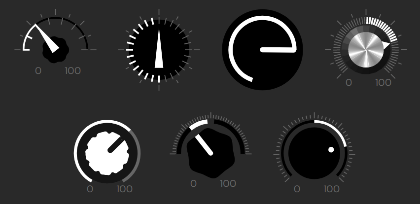

<h1 align="center">x-knob</h1>

<p align="center">
web component that creates knobs for input ranges
</p>

<p align="center"></p>

<p align="center">
   <a href="#install">        🔧 <strong>Install</strong></a>
 · <a href="#example">        🧩 <strong>Example</strong></a>
 · <a href="#api">            📜 <strong>API docs</strong></a>
 · <a href="https://github.com/stagas/x-knob/releases"> 🔥 <strong>Releases</strong></a>
 · <a href="#contribute">     💪🏼 <strong>Contribute</strong></a>
 · <a href="https://github.com/stagas/x-knob/issues">   🖐️ <strong>Help</strong></a>
</p>

***

## Install

```sh
$ npm i x-knob
```

**work in progress**

## API

<!-- Generated by documentation.js. Update this documentation by updating the source code. -->

### Table of Contents

## Contribute

[Fork](https://github.com/stagas/x-knob/fork) or
[edit](https://github.dev/stagas/x-knob) and submit a PR.

All contributions are welcome!

## License

MIT © 2022
[stagas](https://github.com/stagas)
